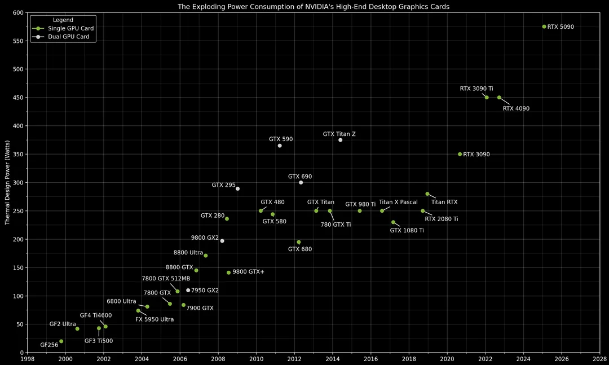
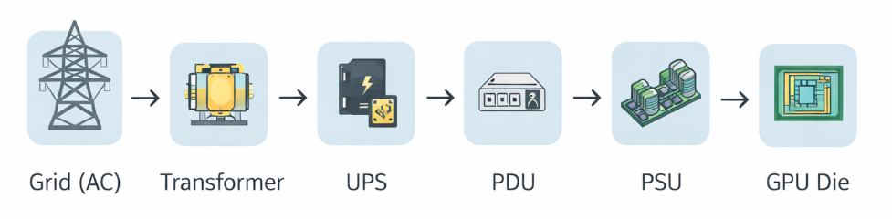

<!-- _class: lead -->

# AXIS 6: Power & Cooling

Charly Saugey  
Paul Haardt  
Corentin Colmel  

Image Major / Epita  
Distributed GPU Systems 2026

---

<!-- header: "AXIS 6: Power & Cooling" -->

## Mission
- Explain the power and cooling challenges of modern AI infrastructures  
- Compare cooling technologies and analyze datacenter design trade-offs

---

## Part A: Evolution of AI System Power

---

<!-- header: "Part A: Evolution of AI System Power" -->

### GPU Power Evolution

**Key questions**
- How has GPU power consumption evolved?
- What is driving the increase in power?
- Is there a maximum ceiling to GPU power?
- How does power scale with performance?

---

| GPU | Year | TDP (W) | FP16 TFLOPs | W/TFLOP | Process Node |
|---|---:|---:|---:|---:|---|
| V100 | 2017 | 300 | 125 | 2.40 | TSMC 12nm FFN |
| A100 | 2020 | 400 | 624 | 0.64 | TSMC 7nm |
| H100 SXM | 2022 | 700 | 1979 | 0.35 | TSMC 4N |
| H200 SXM | 2024 | 700 | 1979 | 0.35 | TSMC 4N |
| B200 SXM | 2024 | 1000 | 4500 | 0.22 | TSMC 4NP |
| B300 | 2025 | 1100 | 5000 | 0.22 | TSMC 4NP |
| R100 (Rubin) | 2026 | _~2300_ | _~4000_ | _~0.58_ | _TSMC N3_ |

---

**System-level power (full node)**

| System | GPUs | GPU Power | Total System Power | Year |
|---|---|---:|---:|---:|
| DGX-1 | 8× V100 | 2.4 kW | ~3.5 kW | 2017 |
| DGX A100 | 8× A100 | 3.2 kW | ~6.5 kW | 2020 |
| DGX H100 | 8× H100 SXM | 5.6 kW | ~10.2 kW | 2022 |
| DGX B200 | 8× B200 SXM | 8.0 kW | ~14.3 kW | 2024 |
| GB200 NVL72 | 72× B200 | 72.0 kW | ~120 kW | 2024 |

---

**Evolution of rack power density**

| Era | Typical Rack Power | kW/rack | Cooling Method |
|---|---:|---:|---|
| Traditional IT (2010) | 5–10 kW/rack | ~8 | Air |
| GPU compute (2018) | 15–25 kW/rack | ~20 | Air |
| AI training (2022) | 30–50 kW/rack | ~40 | Air / DLC |
| AI training (2024) | 60–120 kW/rack | ~80 | DLC required |
| AI training (2026) | 150–300 kW/rack | ~200 | DLC / Immersion |

---

---

<!-- header: "AXIS 6: Power & Cooling" -->
## Part B: GPU Power Delivery

---

<!-- header: "Part B: GPU Power Delivery" -->
### How does GPU power delivery work?

**Key questions**
- From grid to chip: what are the conversion stages?
- Where do efficiency losses occur?
- How is power distributed inside a GPU?

---

| Stage | Input | Output | Typical Efficiency | Loss |
|---|---|---|---:|---:|
| Utility transformer | HV AC (10–30 kV) | LV AC (400–480 V) | 98–99% | 1–2% |
| UPS | AC | AC (conditioned) | 94–97% | 3–6% |
| PDU | AC | AC | 98–99% | 1–2% |
| PSU (AC-DC) | AC (200–240 V) | DC (12 V / 48 V) | 92–96% | 4–8% |
| VRM (DC-DC) | DC (12 V / 48 V) | DC (~0.7–1.1 V) | 85–95% | 5–15% |

---

### Voltage Regulator Modules (VRMs)

**Questions**
- What is a VRM and why is it critical?
<!-- The VRM converts 12 V / 48 V into sub-1 V supply for the cores. It is critical because it must provide stable, low-noise voltage. -->
- What are phases and how do they work?
<!-- One phase = controller + MOSFETs + inductor
Phases operate in parallel to share current and reduce ripple. -->
- Why is VRM efficiency important?
<!-- If a GPU consumes 1 kW and VRM efficiency is 90%, then 10% (100 W) is dissipated as heat that must be removed. -->
- What are the thermal challenges?
<!-- Multiple challenges:
 - Reduce input power losses converted to heat
 - Limit thermal impact on performance
 - Remove heat as efficiently as possible -->

---

| VRM Aspect | Description | Typical Value |
|---|---|---|
| Input voltage | Voltage supplied to VRM | 12 V or 48 V |
| Output voltage | Core supply voltage (Vcore) | 0.7–1.1 V |
| Phase count | Parallel VRM phases | 10–20 phases |
| Efficiency | DC-DC conversion efficiency | 85–95% |
| Power loss (1kW GPU) | Heat dissipated by VRM | 50–150 W |

---

### 12V vs 48V Power Distribution

- Why is 48V better for high-power systems?
<!-- With 4× higher voltage, current is reduced by 4× for the same power, which strongly reduces resistive losses. -->
- Who is pushing 48V adoption?
<!-- Most GPU and hyperscale ecosystem players -->
- What are the challenges?
<!-- More complex VRMs, higher risk of electrical arcing between very close components, and compatibility requirements across devices -->

---

| Aspect | 12V Distribution | 48V Distribution |
|---|---|---|
| Current for 1kW | ~83 A | ~21 A |
| Cable thickness | Thick (high current) | Thinner |
| I²R losses | High (×16 vs 48V) | Much lower |
| Connector size | Large / many pins | Smaller / fewer pins |
| Industry adoption | Legacy servers | AI & hyperscale |

---

### Connector considerations

| Connector | Max Power | Pins | Issues |
|---|---:|---:|---|
| 8-pin PCIe | 150 W | 8 | Limited power, multiple cables needed |
| 12VHPWR | 600 W | 16 (12+4 sense) | Overheating, insertion sensitivity |
| 12V-2x6 | 600 W | 16 (12+4 sense) | Improved safety, still high current |

---

### 800V DC for AI factories

**Questions**
- Why is NVIDIA pushing 800V DC?
- What efficiency gains are possible?
- How does this change datacenter design?
- What are the safety considerations?
<!-- To reduce current inside ultra-high-power racks and therefore reduce resistive losses.
Fewer conversion stages, fewer loss points, and better power delivery along racks.

High-voltage DC = persistent arcs, higher insulation, stricter disconnection systems, procedures, and trained personnel -->

---

<!-- header: "AXIS 6: Power & Cooling" -->
## Part C: Cooling Technologies

---

<!-- header: "Part C: Cooling Technologies" -->
### Air Cooling

**Questions**
- How does air cooling work?
- What are the design principles of a heat sink?
- What are the limits?
- When does air cooling fail?
- At what TDP does air become impractical?
- What are the acoustic limits?
- How does altitude affect air cooling?
<!-- By convection: the hot component heats surrounding air; with a fan or airflow, hot air is expelled, restoring temperature gradient.
The second law of thermodynamics drives heat flow from hot component to cooler air repeatedly. -->
<!-- Goal: maximize thermal exchange surface between hot component and air -->
<!-- Convective cooling is less efficient than conductive cooling -->
<!-- If ambient air is hot, it may no longer absorb enough heat -->
<!-- ~750 W -->
<!-- ~75 dB -->
<!-- Higher altitude = lower air density = less effective cooling for same airflow volume = higher airflow required -->

---

| Air Cooling Aspect | Typical Value | Limit |
|---|---:|---:|
| Max heat dissipation per GPU | 400–600 W | ~700–800 W |
| Max rack density | 20–40 kW | ~50 kW |
| Airflow per rack | 85–170 $m^3m^{-1}$ | ~225 $m^3m^{-1}$ |
| Fan power overhead | 5–10% | ~15% |

---

### Direct Liquid Cooling (DLC)

**How does DLC work?**
- Cold plate design and attachment
- Manifolds and distribution systems
- Coolant types and flow rates
- Heat rejection (CDU, dry coolers, cooling towers)
<!-- Metal plate in direct contact with GPU, heat transferred to fluid -->
<!-- Piping networks distributing fluid to each cold plate -->
<!-- Water/glycol or dielectric fluids, flow optimized for target ΔT -->
<!-- CDU (Coolant Distribution Units) + external heat exchangers (dry coolers or cooling towers) -->

---

| DLC Component | Function | Key Specifications |
|---|---|---|
| Cold plate | Heat transfer from GPU to liquid | Aluminum/copper surface, low ΔT |
| Manifold | Distribute fluid to cold plates | Multi-port, balanced flow |
| Quick disconnects | Leak-free maintenance connections | ≤0.5% leakage, high pressure |
| CDU (Coolant Distribution Unit) | Pump + heat exchanger + filtration | 10–100 L/min, filters |
| Facility water loop | Reject heat to building | Dry coolers or cooling towers |

---

| Aspect | Air Cooling | Direct Liquid Cooling |
|---|---|---|
| Max GPU TDP supported | ~700–800 W | ~1500+ W |
| Max rack density | ~40–50 kW | ~100–200+ kW |
| PUE impact | Higher overhead | Lower overhead |
| Maintenance complexity | Low | Medium/High |
| Capital cost | Lower | Higher (install + CDU) |
| Operating cost | Higher fan energy | Lower pumping energy |

---

| Coolant | Thermal Properties | Cost | Safety | Use Case |
|---|---|---|---|---|
| Water/glycol | Very high heat capacity, high thermal conductivity | Low | Conductive, leak risk | Cold plates, DLC loops |
| Propylene glycol | Slightly lower than water, freeze protection | Low–Medium | Less toxic than ethylene glycol | Cold climates, DLC |
| Dielectric fluids | Lower than water, electrically insulating | High | Non-conductive, safer for electronics | Immersion cooling |

---

### Immersion Cooling

**Topics**
- Single-phase vs two-phase  
- Tank design and fluid management  
- Heat rejection methods  
- Maintenance considerations

---

| Aspect | Single-Phase Immersion | Two-Phase Immersion |
|---|---|---|
| Fluid type | Dielectric oil | Low-boiling dielectric fluid |
| Operating principle | Liquid absorbs heat, remains liquid | Liquid boils, vapor condenses |
| Max heat flux | High | Very high |
| Fluid cost | Medium | High |
| Complexity | Medium | High |
| Maturity | Commercially mature | Emerging / niche |

---

| Advantage | Challenge |
|---|---|
| Highest heat density | Specialized fluids |
| No fans required | Hardware compatibility |
| Reduced PUE | Higher CAPEX |
| Component longevity | Maintenance procedures |

---

### Rear-Door Heat Exchangers (RDHx)

**Questions**
- What is RDHx?  
- How does it supplement air cooling?  
- What power densities can it support?  
- When is it the right choice?  
<!-- Air-to-liquid heat exchanger mounted at rear of rack that captures exhaust air and removes heat using a water loop -->
<!-- It cools air locally at rack level, reducing room thermal load and improving efficiency of existing air cooling -->
<!-- Roughly 20,000–80,000 W per rack depending on passive or active design -->
<!-- When an air-cooled datacenter must support denser racks without immediate transition to DLC or immersion -->

---

| RDHx Type | Cooling Capacity | Best For |
|---|---:|---|
| Passive RDHx | ~20,000–35,000 W per rack | Medium-density racks, retrofit |
| Active RDHx | ~30,000–80,000 W per rack | High-density GPU racks |

---

<!-- header: "AXIS 6: Power & Cooling" -->
## Part D: Power Usage Effectiveness (PUE)

---

<!-- header: "Part D: Power Usage Effectiveness (PUE)" -->
### Understanding PUE

**Definition**
- PUE = Power Usage Effectiveness  
- PUE = Total Facility Power / IT Equipment Power  
- 1 PUE = (IT Load + Cooling + Power Distribution + Lighting + Other) / IT Load

---

**Questions**
- What does PUE measure and not measure?
- How does cooling choice affect PUE?
- What are the components of overhead?
<!-- PUE measures datacenter infrastructure efficiency but not application, server, or workload efficiency -->
<!-- Cooling, power distribution losses, UPS, lighting, security, auxiliary systems -->
<!-- Liquid cooling solutions significantly reduce cooling energy and therefore PUE -->

---

| PUE Component | Typical % of Overhead | Reduction Strategies |
|---|---:|---|
| Cooling | 40–60 % | DLC, free cooling, containment |
| Power distribution losses | 10–15 % | High-efficiency UPS/PSU |
| Lighting and other | 5 % | LED, automation |

---

**PUE benchmarks**

| Datacenter Type | Typical PUE | Best-in-Class PUE |
|---|---:|---:|
| Legacy enterprise | 1.8–2.5 | 1.6 |
| Modern enterprise | 1.4–1.6 | 1.3 |
| Hyperscale (air) | 1.2–1.4 | 1.1 |
| Hyperscale (DLC) | 1.1–1.2 | 1.05 |
| AI-optimized | 1.1–1.3 | 1.05 |

---

| Cooling Method | Typical PUE | Why |
|---|---:|---|
| Traditional air (CRAC) | ~1.6 | Energy-intensive compressors |
| Hot/cold aisle containment | ~1.4 | Optimized airflow |
| Free air cooling | ~1.2 | Minimal active cooling |
| Direct liquid cooling | ~1.1 | Direct heat transfer |
| Immersion cooling | ~1.05 | Near elimination of HVAC |

---

**Best-in-class examples**

| Company | Facility | PUE | How Achieved |
|---|---|---:|---|
| Google | Hyperscale DC | 1.10 | Free cooling + AI control |
| Meta | Hyperscale DC | 1.09 | Free cooling |
| Microsoft | Azure DC | 1.12 | Free air + DLC |
| NVIDIA DGX Cloud | AI DC | ~1.1 | Liquid cooling |

---

**Beyond PUE: other efficiency metrics**

| Metric | Definition | Typical Values | Best-in-Class |
|---|---|---|---|
| PUE | Total/IT ratio | 1.1–1.6 | ~1.05 |
| WUE | Liters water / kWh IT | 0.2–1.8 | <0.2 |
| CUE | kgCO₂ / kWh IT | Variable | Near zero |

<!-- WUE = Water Usage Effectiveness -->
<!-- CUE = Carbon Usage Effectiveness -->

---

<!-- header: "AXIS 6: Power & Cooling" -->
## Part E: Infrastructure Requirements

---

<!-- header: "Part E: Infrastructure Requirements" -->
### Power Density Planning

**Questions**
- How do you plan for increasing density?
- What infrastructure upgrades are needed?
- How do you handle mixed densities?
<!-- Modular power and cooling, oversizing pathways, liquid-ready racks -->
<!-- Higher-capacity busways, transformers, UPS, liquid cooling loops -->
<!-- Zoning: air-cooled rows + liquid-cooled rows -->

---

| Density Tier | kW/Rack | Infrastructure Requirements |
|---|---:|---|
| Low density | 5,000–10,000 W | Air cooling, standard power |
| Medium density | 10,000–30,000 W | Hot/cold aisle, high airflow |
| High density | 30,000–80,000 W | RDHx or DLC |
| Ultra-high density | >80,000 W | DLC or immersion |

---

### Power distribution architecture

| Component | Function | Sizing Consideration |
|---|---|---|
| Utility feed | Power from grid | Peak MW + redundancy |
| Main switchgear | Distribution & protection | Fault current rating |
| UPS systems | Backup & conditioning | MW load, minutes runtime |
| PDUs | Rack-level distribution | kW per rack |
| RPPs | Branch circuits | Density zones |

---

### Cooling capacity planning

| Cooling capacity Unit | Conversion | Context |
|---|---|---|
| 1 ton of cooling | 12,000 BTU/h | 3.52 kW |
| 1 kW IT load (air) | 0.0003 ton | Includes overhead |
| 1 kW IT load (DLC) | 0.00028 ton | Direct rejection |

---

**Water requirements for liquid cooling**

| Cooling Method | Water Usage | m³/h per MW |
|---|---|---:|
| Evaporative (cooling tower) | High | 1.5–2 |
| Dry cooler | Low | 0.1–0.3 |
| DLC (closed loop) | Very low | ~0.05 |

---

### Backup power systems

| UPS Type | Efficiency | Runtime | Best For |
|---|---:|---:|---|
| Double conversion | 94–97% | 5–15 min | Critical loads |
| Line interactive | 96–98% | 5–10 min | Edge DC |
| Rotary UPS | 96–98% | Seconds | Large DC |
| Battery + flywheel | 95–98% | Seconds–minutes | High power |

---

**Generator requirements**

| Facility Size | Generator Capacity | Fuel Storage | Startup Time |
|---:|---|---|---|
| 10 MW | 10–12 MW | Hours | <10 s |
| 100 MW | 120 MW | Hours | <10 s |
| 500 MW | 600 MW | Hours | <15 s |
| 1 GW | 1.2 GW | Hours | <15 s |

---

### Grid connection for gigawatt-scale sites

| Scale | Grid Requirements | Typical Lead Time |
|---:|---|---|
| 50 MW | Substation tie-in | 1–2 years |
| 200 MW | Dedicated substation | 2–3 years |
| 500 MW | Transmission upgrade | 3–5 years |
| 1 GW+ | New transmission lines | 5+ years |

---

### Power sourcing strategies

| Strategy | Description | Pros | Cons |
|---|---|---|---|
| Grid connection | Utility power | Simple | Carbon intensity |
| On-site generation | Gas/diesel | Fast backup | Emissions |
| PPA | Long-term renewable contract | Green energy | Price lock |
| Behind-the-meter solar/wind | Local generation | Low carbon | Intermittent |
| Nuclear (SMR) | Small modular reactors | Stable low-carbon | Regulatory |

---

<!-- header: "AXIS 6: Power & Cooling" -->
## Part F: Deep Dive Topics

---

<!-- header: "Part F: Deep Dive Topics" -->
### Chip-Level Power Management

**Dynamic Voltage and Frequency Scaling (DVFS)**
- How does DVFS work?
- What is the power/frequency relationship?
<!-- The processor dynamically adjusts voltage and frequency based on workload and temperature.
Dynamic power approximately follows: P ∝ V² × f -->

---

| Power State | Voltage | Frequency | Power | Use Case |
|---|---:|---:|---:|---|
| Max boost | High | High | Very high | Peak compute |
| Base clock | Nominal | Nominal | High | Sustained |
| Idle | Low | Low | Low | Low utilization |
| Sleep | Very low | ~0 | Very low | Inactive |

---

### Thermal throttling behavior

| Threshold | Temperature | Action |
|---|---|---|
| Target | ~83 °C | Nominal frequency |
| Throttle start | ~85 °C | Frequency reduction |
| Max operating | ~90 °C | Power limiting |
| Shutdown | ~95 °C | Hardware shutdown |

---

### Heat sink and cold plate design

| Parameter | Impact | Tradeoff |
|---|---|---|
| Fin density | Heat transfer surface | Airflow restriction |
| Base thickness | Heat spreading | Mass |
| Heat pipe count | Heat transport | Cost |
| Material (Cu vs Al) | Thermal conductivity | Weight / price |

---

| Design Aspect | Consideration | Best Practice |
|---|---|---|
| Contact area | Thermal resistance | Maximum coverage |
| Channel design | Turbulence | Microchannels |
| Flow rate | Liquid ΔT | Sufficient, not excessive |
| Pressure drop | Pump load | Minimize |

---

### Stranded Power in Datacenters

**Questions**
- What is stranded power?
- Why does it occur?
- How much power is typically stranded?
- How do you minimize stranded capacity?
<!-- Installed electrical capacity that cannot be used.
Cooling limits or rack-level imbalance.
10–30% of capacity.
Density zoning, liquid cooling, workload orchestration. -->

---

<!-- header: "AXIS 6: Power & Cooling" -->
## Part G: Companies & Industry Landscape

---

<!-- header: "Part G: Companies & Industry Landscape" -->
### System Vendors

| Company | Products | Cooling Approach | Market Position |
|---|---|---|---|
| NVIDIA | DGX, MGX, HGX | Air + DLC ready | AI platform leader |
| Dell | PowerEdge XE | Air + DLC | Enterprise AI servers |
| HPE | Cray EX | DLC | HPC & AI leader |

---

| Company | Products | Cooling Approach | Market Position |
|---|---|---|---|
| Supermicro | GPU servers | Air + DLC | Broad OEM supplier |
| Lenovo | ThinkSystem | Air + DLC | Enterprise / HPC |

---

### Cooling Infrastructure Vendors

| Company | Products | Technology Focus |
|---|---|---|
| Vertiv | Liebert, CDUs | Full-stack cooling |
| Schneider Electric | APC, cooling | Power + thermal |
| Asetek | Cold plates, CDUs | DLC pioneer |
| CoolIT | DLC systems | Rack-level DLC |
| GRC | ICEraQ | Single-phase immersion |
| LiquidCool | Immersion tanks | Two-phase immersion |
| Submer | SmartPod | Immersion systems |

---

### Power Infrastructure Vendors

| Company | Products | Specialty |
|---|---|---|
| Schneider Electric | UPS, PDUs, switchgear | End-to-end power |
| Vertiv | UPS, PDUs | Critical power |
| Eaton | UPS, PDUs | Power distribution |
| ABB | Transformers, switchgear | Utility-scale |
| Caterpillar | Generators | Backup power |

---

<!-- header: "AXIS 6: Power & Cooling" -->
## Part H: Final Comparison

---

<!-- header: "Part H: Final Comparison" -->

### Cooling Technology Comparison

| Aspect | Air Cooling | Rear-Door HX | Direct Liquid | Single-Phase Immersion | Two-Phase Immersion |
|---|---|---|---|---|---|
| Max kW/rack | ~20–50 kW | ~20–80 kW | ~50–200+ kW | ~80–250+ kW | ~100–300+ kW |
| PUE achievable | ~1.2–1.6 | ~1.15–1.4 | ~1.05–1.2 | ~1.03 | ~1.02 |
| Capital cost | Low | Medium | High | High | Very high |
| Operating cost | Medium/High | Medium | Low/Medium | Low | Low |
| Maintenance | Simple | Moderate | Moderate/Complex | Complex | Very complex |
| Maturity | Very mature | Mature | Mature | Mature (commercial) | More niche |
| GPU compatibility | Universal | Universal | Cold plate required | Immersion-compatible hardware | Immersion-compatible hardware |

---

### AI System Power Summary

| System | GPUs | Total Power | Cooling Method | Rack Density |
|---|---|---:|---|---:|
| DGX A100 | 8× A100 | ~6.5 kW | Air | Variable (depends on servers per rack) |
| DGX H100 | 8× H100 | ~10.2 kW | Air / DLC | Variable |
| DGX B200 | 8× B200 | ~14.3 kW | DLC | Variable |
| GB200 NVL72 | 72× B200 | ~120 kW | DLC | ~120 kW/rack |
| AMD MI300X (8-way) | 8× MI300X | ~12.5 kW | Air | Variable |
| Google TPU v5p pod | 8,960 TPU v5p chips | Not disclosed | DLC | Not disclosed |

---

### Datacenter Efficiency Comparison

| Operator | Facility Type | PUE | WUE | Cooling Method |
|---|---|---:|---:|---|
| Google | Hyperscale | 1.09 (2024) | Not publicly disclosed (global) | Mix (free cooling + liquid depending on site) |
| Meta | Hyperscale | 1.08 (2023 avg) | WUE reported (see sustainability report) | Mix (air optimizations + water systems) |
| Microsoft | Azure | Not publicly disclosed (global) | WUE improvement reported | Mix (air + “zero-water” innovations on new sites) |
| AWS | Cloud | 1.15 (global) | Not publicly disclosed (global) | Mix (air + optimizations) |
| CoreWeave | AI-focused | 1.15 (Barcelona site announced) | “Zero water” announced (Barcelona site) | Free air + optimized design |
| Lambda Labs | AI-focused | Not disclosed | Not disclosed | Not disclosed |

---

### TCO Impact of Cooling Choice

| Cost Component | Air Cooling | DLC | Immersion |
|---|---:|---:|---:|
| Capital ($/kW IT) | Low | High | High / Very high |
| Power cost ($/kW-yr) | High (fans/HVAC) | Lower | Lower |
| Maintenance ($/kW-yr) | Low | Medium | High |
| Floor space ($/kW-yr) | High (limited density) | Lower | Lower |
| 5-year TCO ($/kW) | Variable (often higher at high density) | Often lower at high density | Often lower if extreme density |

---

<!-- header: "AXE 6 : Puissance & Refroidissement" -->
## Sources

---

<!-- header: "Sources" -->
### Part A
- https://images.nvidia.com/content/technologies/volta/pdf/volta-v100-datasheet-update-us-1165301-r5.pdf
- https://www.horizoniq.com/blog/nvidia-a100-specs/
- https://www.clarifai.com/blog/nvidia-h100#title_1
- https://cyfuture.cloud/blog/v100-vs-h100-vs-a100-nvidia-tesla-gpu-comparison-guide/#Core_Architectural_Comparison_V100_vs_A100_vs_H100
- https://docs.nvidia.com/dgx/dgxa100-user-guide/introduction-to-dgxa100.html#component-description
---
- https://www.amax.com/comparing-nvidia-blackwell-configurations/
- https://flopper.io/system/nvidia-gb200-nvl72
- https://axautikgroupllc.substack.com/p/here-is-how-much-power-we-expect

---

### Part B

- https://en.wikipedia.org/wiki/12VHPWR#Standard_for_connecting_GPUs_to_power_supplies
- https://en.wikipedia.org/wiki/12VHPWR#Reliability_and_design_changes
- https://blog.se.com/datacenter/2018/05/24/12v-vs-48v-the-rack-power-architecture-efficiency-calculator-illustrates-energy-savings-of-ocp-style-psus/
---
- https://www.jotrin.com/technology/details/voltage-regulator-module?srsltid=AfmBOorjHdTB74oXBs--yB8n8hgdWjcieQGzOH0SP1RhFnWyh-v15lQU
- https://www.vicorpower.com/industries-and-innovations/vicor-48v/12v-48v-conversion

---

### Part C

- https://www.submer.com/immersion-cooling/#what-is-immersion-cooling
- https://www.submer.com/blog/single-phase-vs-two-phase-immersion-cooling/
- https://www.grcooling.com/immersion-cooling/#single-phase-immersion
- https://www.grcooling.com/immersion-cooling/#two-phase-immersion

---

### Part D

- https://www.google.com/about/datacenters/efficiency/#measuring-efficiency
- https://www.google.com/about/datacenters/efficiency/#pue
- https://www.google.com/about/datacenters/efficiency/#cooling
- https://aws.amazon.com/sustainability/data-centers/#Measuring_efficiency
- https://aws.amazon.com/sustainability/data-centers/#Power_Usage_Effectiveness
- https://www.microsoft.com/en-us/microsoft-cloud/blog/2024/12/09/sustainable-by-design-next-generation-datacenters-consume-zero-water-for-cooling/
---
- https://datacenters.google/efficiency
- https://sustainability.atmeta.com/wp-content/uploads/2024/08/Meta-2024-Sustainability-Report.pdf
- https://www.uptimeinstitute.com/resources/white-papers/understanding-pue

---

### Part E

- https://www.uptimeinstitute.com/resources/white-papers/designing-for-high-density-data-centers
- https://www.uptimeinstitute.com/resources/white-papers/power-distribution-in-the-data-center
- https://www.iea.org/reports/electricity-grids-and-secure-energy-transitions
- https://www.world-nuclear.org/information-library/nuclear-fuel-cycle/nuclear-power-reactors/small-nuclear-power-reactors.aspx

---

### Part F

- https://developer.nvidia.com/blog/nvidia-hopper-architecture-in-depth/#power-management
- https://developer.nvidia.com/blog/nvidia-hopper-architecture-in-depth/#clocking-and-voltage
- https://www.anandtech.com/show/17626/nvidia-hopper-h100-architecture-deep-dive/3
- https://www.anandtech.com/show/17626/nvidia-hopper-h100-architecture-deep-dive/4
---
- https://en.wikipedia.org/wiki/Dynamic_voltage_scaling
- https://www.uptimeinstitute.com/resources/white-papers/thermal-management-in-the-data-center

---

### Part G

- https://www.nvidia.com/en-us/data-center/dgx-platform/
- https://www.dell.com/en-us/shop/poweredge-servers/sr/servers/poweredge-xe
- https://www.vertiv.com/en-us/products-catalog/thermal-management/
- https://www.coolitsystems.com/data-center/
- https://www.grcooling.com/immersion-cooling/
- https://www.submer.com/immersion-cooling/
- https://www.submer.com/products/smartpod/
---
- https://www.liquidcoolsolutions.com/immersion-cooling/
- https://new.abb.com/medium-voltage/switchgear

---

### Part H

- https://images.nvidia.com/aem-dam/Solutions/Data-Center/nvidia-dgx-a100-datasheet.pdf
- https://docs.nvidia.com/dgx/dgxh100-user-guide/introduction-to-dgxh100.html#power-specifications
- https://www.nvidia.com/en-us/data-center/dgx-b200/
- https://www.nvidia.com/en-us/data-center/gb200-nvl72/
- https://www.sunbirddcim.com/blog/your-data-center-ready-nvidia-gb200-nvl72
---
- https://docs.cloud.google.com/tpu/docs/v5p#system_architecture
- https://docs.cloud.google.com/tpu/docs/v5p#configurations
- https://cloud.google.com/blog/products/ai-machine-learning/introducing-cloud-tpu-v5p-and-ai-hypercomputer
- https://datacenters.google/efficiency
- https://sustainability.atmeta.com/wp-content/uploads/2024/08/Meta-2024-Sustainability-Report.pdf
- https://aws.amazon.com/sustainability/data-centers/
---
- https://www.microsoft.com/en-us/microsoft-cloud/blog/2024/12/09/sustainable-by-design-next-generation-datacenters-consume-zero-water-for-cooling/
- https://www.edged.es/news/coreweave-partners-with-edged
- https://submer.com/blog/single-phase-vs-two-phase-immersion-cooling/
